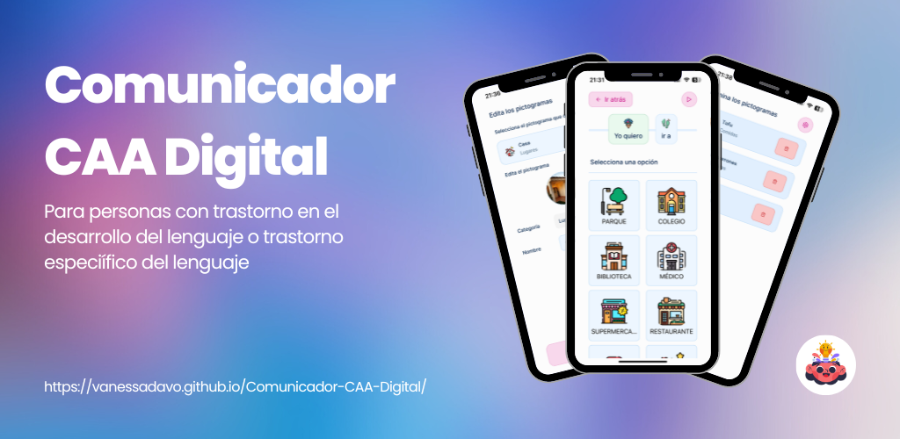
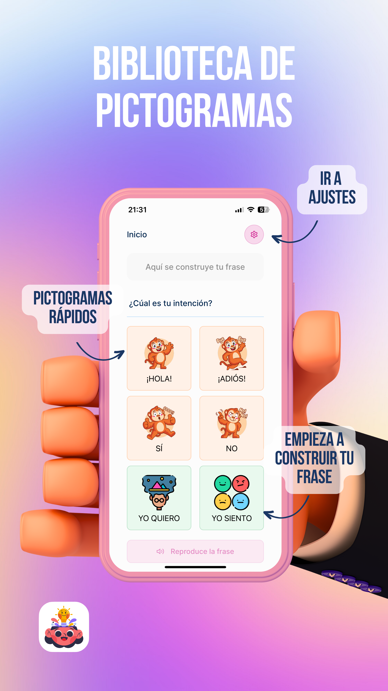
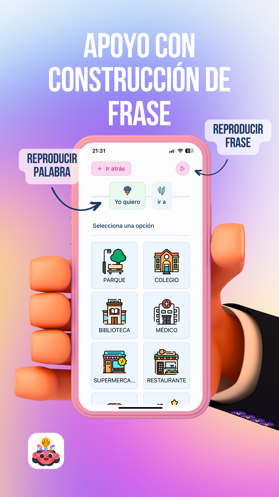
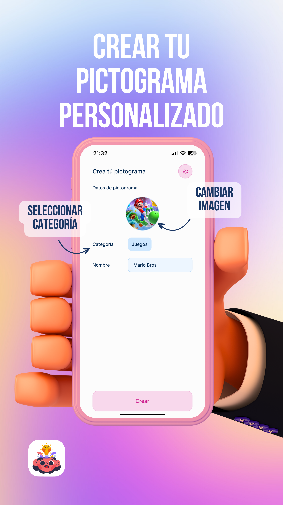
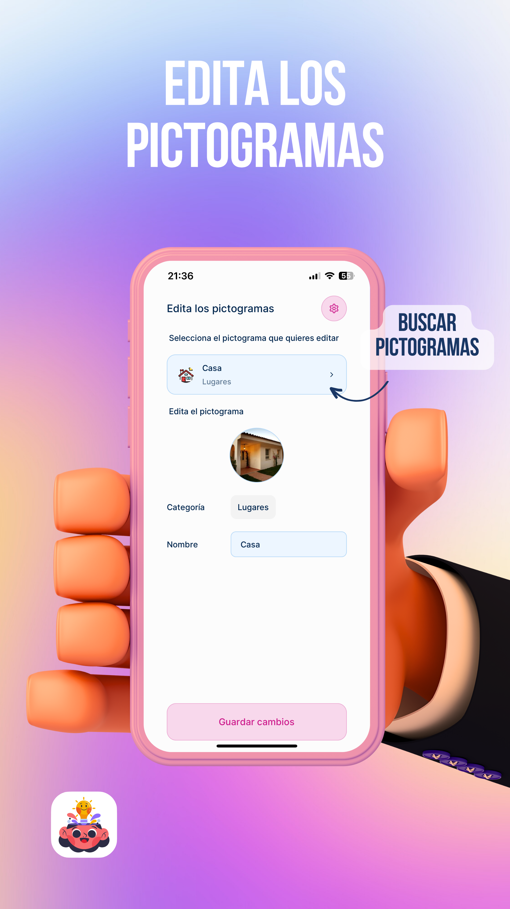

# Comunicador CAA Digital - Documentación

## Descripción

Comunicador CAA Digital es una aplicación desarrollada como trabajo de final de grado en Ingeniería Multimedia. La aplicación es un comunicador digital empleando SAAC.

Un SAAC (Sistema Aumentativo y Alternativo de Comunicación) es un conjunto de herramientras y estrategias que permiten comunicar a una persona un deseo, sentimiento o necesidad a través de sistemas gráficos, en nuestro caso, el usuario tiene un conjunto de pictogramas que podrá ir seleccionando para construir una frase simplificada que exprese en su significado completo un deso, emoción o necesidad. Estos pictogramas se pueden editar, crear o eliminar, permitiendo de esta forma al usuario personalizar su experiencia dependiendo de sus necesidades individuales.

Además, la aplicación cuenta con una voz sintética que reproduce de forma hablada cada una de las palabras de la frase y también el conjunto.

Con Comunicador CAA Digital, los usuarios pueden comunicarse de forma activa en diferentes contextos.

_Es un proyecto que trata de dar autonomía, independencia y voz a las personas que tienen trastorno en el desarrollo del lenguaje, trastorno específico del lenguaje o disfasia._

**[Enlace a la App](https://vanessadavo.github.io/Comunicador-CAA-Digital/)**

## Documentación y Política

Para obtener información detallada sobre la aplicación, incluyendo su política de uso, por favor visita la [política de privacidad](https://vanessadavo.github.io/Comunicador-CAA-Digital/politica.html).

## Capturas de Pantalla

|  |  |
| :-----------------------------------------------------------: | :-------------------------------------------------------------: |
|     _Biblioteca de pictogramas de la pantalla de Inicio_      |                  _Apoyo construcción de frase_                  |

|  |  |
| :----------------------------------------------------------------: | :----------------------------------------------------: |
|                  _Crear pictograma personalizado_                  |                  _Editar pictogramas_                  |

## Tecnologías Utilizadas

- **React-native**: React Native es un marco de desarrollo de aplicaciones móviles que permite crear aplicaciones nativas para iOS y Android utilizando JavaScript y React. Utiliza los mismos componentes de interfaz de usuario que una aplicación nativa y ofrece un alto rendimiento y una experiencia de usuario fluida. Es una opción popular para el desarrollo de aplicaciones móviles multiplataforma.
  **Documentación oficial:** [React Native](https://reactnative.dev/)

- **Expo**: Expo es una plataforma y conjunto de herramientas que facilita el desarrollo de aplicaciones móviles utilizando React Native. Proporciona una serie de características y servicios preconstruidos que ayudan a acelerar el proceso de desarrollo, como la gestión de activos, el acceso a funciones del dispositivo y la implementación sencilla. Expo también permite una fácil distribución y prueba de aplicaciones en dispositivos móviles.
  **Documentación oficial:** [Expo](https://docs.expo.dev/)

- **Redux**: Redux es una biblioteca de gestión de estado para aplicaciones JavaScript, incluidas las aplicaciones React y React Native. Proporciona un contenedor centralizado para el estado de la aplicación y permite que los componentes accedan y actualicen ese estado de manera predecible y eficiente. Redux se basa en el patrón de diseño Flux y es ampliamente utilizado para mantener un estado global coherente en aplicaciones complejas.
  **Documentación oficial:** [Redux](https://redux.js.org/)

- **Typescript**: TypeScript es un lenguaje de programación de código abierto desarrollado por Microsoft que amplía JavaScript al agregar tipos estáticos opcionales y otras características avanzadas. Permite detectar errores durante la fase de desarrollo y proporciona una experiencia de desarrollo más robusta y segura. TypeScript es especialmente popular en proyectos grandes o colaborativos donde la detección temprana de errores es fundamental.
  **Documentación oficial:** [TypeScript](https://www.typescriptlang.org/docs/)

## Contribuciones

Este proyecto se desarrolló como parte de un trabajo de final de grado, por lo que no acepta contribuciones externas en el repositorio. Sin embargo, si tienes comentarios o sugerencias sobre la aplicación, ¡estaré encantada de escucharlos y responderlos!

## Soporte

Si tienes alguna pregunta o consulta sobre Comunicador CAA Digital, por favor no dudes en contactarme por developer@vanessadavo.com o a través de mi perfil de GitHub.

## Licencia

Todos los derechos de autor de este proyecto están reservados por Vanessa Davó. Todo el contenido relacionado con el proyecto, incluidas las imágenes, aplicación y contenido, no puede ser utilizado, copiado, modificado o distribuido sin el permiso explícito por escrito del propietario del proyecto.

© 2023 Vanessa Davó

---

¡Gracias por tu interés en Comunicador CAA Digital! Espero que disfrutes explorando y utilizando la aplicación desarrollada como parte de mi trabajo de final de grado. Si tienes alguna pregunta o retroalimentación, por favor no dudes en comunicarte conmigo. Espero que encuentres la aplicación interesante y útil para fomentar el lenguaje en personas con trastorno en el desarrollo del lenguaje.
